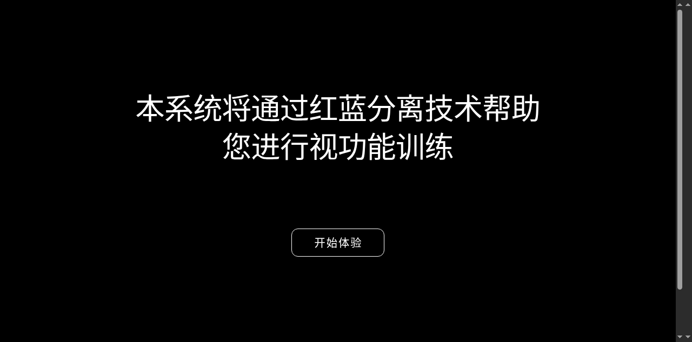
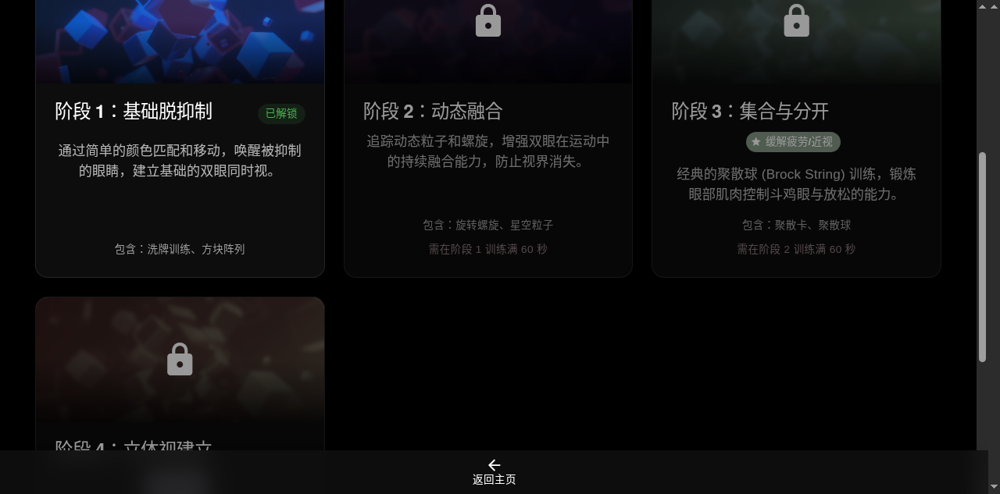
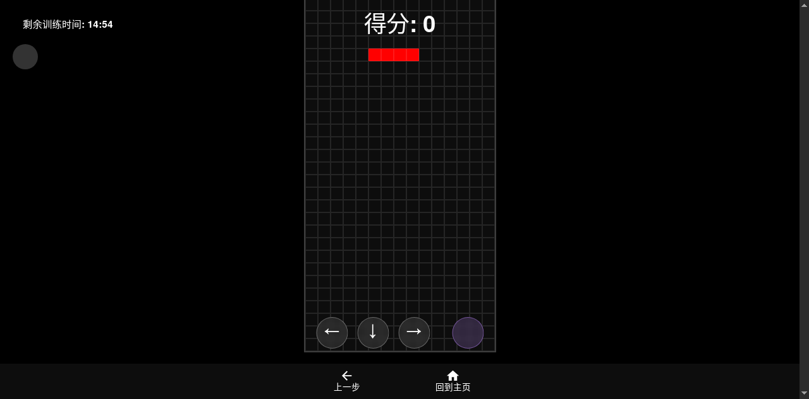
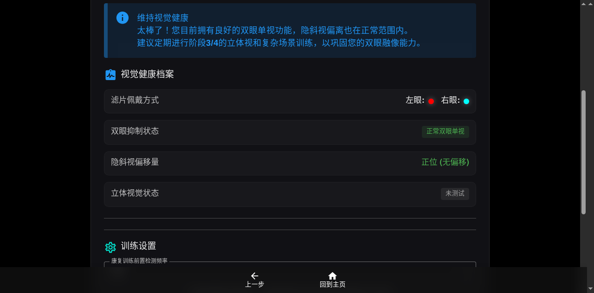

# TwoEyes Vue (双眼视觉康复系统)


> **[在线体验 (Live Demo)](https://xcsweb.github.io/twoeyes-vue/)**

## 为什么选择 TwoEyes Vue？（项目优势与核心亮点）

与市面上昂贵的商业版斜弱视训练软件或医疗机构的笨重设备相比，**TwoEyes Vue** 具有以下无可比拟的优势：

1. **🏥 真正的临床级闭环体系**
   - **商业版痛点**：许多商业软件直接让患者玩固定的红蓝游戏，缺乏精准的测量，参数无法随病情动态调整。
   - **本系统优势**：构建了从 **客观检查（找主导眼、测暗光惩罚阈值、测隐斜视/旋转斜视偏离像素、定级立体视敏度）** 到 **个性化康复（将测量出的偏差精准映射到 3D 渲染和色彩通道上）** 的完整医疗级闭环。

2. **💡 极致的个性化与全动态生成 (Dichoptic Therapy)**
   - **商业版痛点**：通常只能选择固定的难度或固定的分视对比度。
   - **本系统优势**：底层运用了双眼分视疗法（Dichoptic Therapy）核心原理。所有游戏画面**没有一张静态图片**，全部是通过 WebGL / Canvas 实时根据患者的“暗光惩罚阈值”和“隐斜视 X/Y/旋转 坐标”渲染出来的。好眼会被智能压抑，弱视眼会被强制激发，每一帧都是为您量身定制。

3. **👨‍⚕️ 安全的医疗分诊机制与红线预警**
   - **本系统优势**：系统内置了专业的医疗逻辑判断。例如，在模拟双马氏杆试验中，一旦客观检测出用户存在明显的“旋转斜视 (Cyclotropia)”，系统不仅不会诱导用户盲目训练，反而会弹出红色预警，强烈建议患者就医并考虑斜视手术，避免延误病情。

4. **📱 极致轻量与全平台支持**
   - **商业版痛点**：需要购买昂贵的特定主机或去诊所排队使用大型 VR/投影设备。
   - **本系统优势**：基于 Vue 3 + Vite 构建的纯 Web 应用。**只需一副 5 块钱的红蓝（红青）3D 眼镜**，您就可以在任何手机、平板或电脑的浏览器上，随时随地进行专业级的视觉康复训练。

5. **🎨 现代化的 UI/UX 与非侵入式设计**
   - **本系统优势**：拥有全局暗黑沉浸模式、可自由拖拽折叠的悬浮数据面板 (HUD)、以及丝滑的 SPA 路由过渡体验，告别传统医疗软件丑陋、卡顿的界面。

---

## 核心功能展示

### 1. 全面的视功能检查大厅
包含普通视力、对比敏感度、阿姆斯勒黄斑测试，以及核心的斜弱视、立体视筛查。


### 2. 个性化康复训练矩阵
按临床逻辑分为四大阶段：基础脱抑制、动态融合、集合与分开、高级立体视建立。


### 3. 康复训练 (Tetris 示例)
训练游戏（如俄罗斯方块）会自动根据您的检查结果分配弱视眼看高亮的主动下落方块，主导眼看暗光惩罚的底部方块。


### 4. 视觉健康档案与数据追踪
实时记录您的检查数据，并通过折线图比对正常医学基准线，直观展示康复进度。


---

## 交互设计亮点
- 全局沉浸式黑色背景主题。
- 统一的底层路由和全局底部导航栏（Bottom Navigation），彻底消除了繁杂的页面内跳转按钮。
- 高度一致的响应式卡片菜单。
- 完整的 E2E 自动化测试覆盖（使用 Playwright）。

## 技术栈
- [Vue 3](https://vuejs.org/) (Composition API, `<script setup>`)
- [Vuetify 3](https://vuetifyjs.com/) (Material Design UI 组件库)
- [Vite](https://vitejs.dev/) (构建工具)
- [Pinia](https://pinia.vuejs.org/) (状态管理)
- [Vue Router](https://router.vuejs.org/) (路由控制)
- [Three.js](https://threejs.org/) (用于 3D 视觉训练模块)
- [Playwright](https://playwright.dev/) (E2E 自动化测试)

## 本地开发

### 环境要求
- Node.js >= 18

### 安装与运行

```bash
# 1. 克隆仓库
git clone https://github.com/xcsweb/twoeyes-vue.git
cd twoeyes-vue

# 2. 安装依赖
npm install

# 3. 启动开发服务器
npm run dev
```

### 构建与测试

```bash
# 执行生产环境构建
npm run build

# 运行 E2E 自动化测试 (需先启动本地服务并安装 playwright 浏览器)
npx playwright install
npm run test:e2e
```

## 自动化部署
本项目已配置 GitHub Actions 工作流。每次将代码推送到 `main` 分支时，都会自动构建并部署到 [GitHub Pages](https://xcsweb.github.io/twoeyes-vue/)。

## 声明与协议 (License & Disclaimer)

### ⚠️ 免责声明 (Medical Disclaimer)
> 本系统的测试结果和训练方案仅供个人康复训练参考，**绝不作为任何临床医疗诊断依据**。如有严重的视力、斜视或立体视受损问题，请及时前往专业眼科医院就医。

### 🚫 许可协议 (License)
> **版权所有 © 2024 TwoEyes-Vue。本项目仅供个人学习、非盈利性学术研究及个人视觉康复使用。**  
> **禁止商用，侵权必究！**  
> 未经作者明确书面授权，任何人不得将本项目源码、UI设计、医疗逻辑及衍生程序用于任何商业目的（包括但不限于：整合进收费软件、用于医院或诊所的收费治疗项目、二次打包出售等）。详细条款请参阅项目根目录下的 [LICENSE](./LICENSE) 文件。

## 致谢 (Acknowledgments)

本项目在医学底层逻辑、双眼分视疗法 (Dichoptic Therapy) 和立体视康复机制的设计上，深受国内外众多眼科学者和前沿研究文献的启发。
目前本项目**尚未取得**以下论文作者的商业授权，因此再次重申本项目仅为非商业的个人开源实践。

在此，向以下文献的作者及研究团队表达最诚挚的敬意与感谢（排名不分先后）：
- **Ganesh S, et al. (2024)** - *Effectiveness of Dichoptic Therapy for Treating Mild to Moderate Amblyopia. J Pediatr Ophthalmol Strabismus.*
- **Piñero DP, et al. (2023)** - *Visual Performance of Children with Amblyopia after 6 Weeks of Home-Based Dichoptic Visual Training.*
- **Li J, et al. (2013)** - *Dichoptic training improves amblyopic stereopsis. Clinical Ophthalmology.*
- **Ruttum M.S. (1989)** - *The Double Maddox Rod Test for Cyclotropia.*
- 以及所有致力于弱视与斜视数字疗法 (Digital Therapeutics) 研究的医学先驱们。